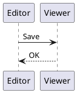

# PlantUML support

Tinta renders PlantUML diagrams by running the real PlantUML program as a separate process. Nothing is bundled: Tinta never downloads anything and never makes network calls for diagrams. You point Tinta at a PlantUML copy you already have.

## Obtaining PlantUML

The [official download page](https://plantuml.com/download) ships compiled jars under several license flavors: GPL, GPL v2, LGPL, Apache, BSD, EPL and MIT. Tinta works with any flavor. The MIT build (a `plantuml-mit` jar) generates all UML diagrams but, like every flavor except GPL, leaves out a few extras such as ditaa; the [FAQ](https://plantuml.com/faq) explains the differences. Tinta only ever runs the tool, so the flavor changes what PlantUML itself can draw, not how Tinta behaves.

Pick one of the two:

- **Native executable**: a `plantuml.exe` from a PlantUML distribution or installer. No separate Java installation is involved.
- **Jar plus Java**: a `plantuml.jar` run through a Java runtime (`java.exe`) available on your `PATH`. Tinta resolves `java` the same way a command shell does; there is deliberately no second setting for Java.

## Configuring Tinta

Open the **PlantUML diagrams** row in Settings and press **Browse**. The picker accepts either a `plantuml.exe` or a `.jar` file. Once a tool is found, the row's hint text is replaced by the exact command Tinta resolved: for a jar, the located `java.exe` plus ` -jar ` and the jar path; for the native tool, the executable path. While the hint is visible, no tool is available and diagrams render as source.

If you configure nothing, Tinta looks for a `plantuml.exe` on `PATH` and uses it when found. The path chosen in Settings persists as `plantumlPath` in `settings.ini` (in `%APPDATA%\Tinta`, or beside `tinta.exe` in portable mode). There are no other PlantUML settings and no environment variables are read.

## What renders

Two shapes trigger rendering:

- Fenced blocks with the language `plantuml`, `puml` or `pu` inside a Markdown document.
- Standalone `.puml` or `.plantuml` files, which open straight as a diagram and export and print like any other document.

Only the first `@startuml` block of a source is rendered, and the anchor is required - it may carry a block name, in either the `@startuml Flow` or the `@startuml(Flow)` form. Non-UML start tags such as `@startjson`, `@startyaml` or `@startmindmap` are not detected. Tinta never auto-wraps an unanchored source: PlantUML ignores `skinparam` lines written before `@startuml`, so silently adding a wrapper would change where your theme statements apply. Unanchored text stays a readable code block.

## How rendering works

Before spawning the tool, Tinta injects `skinparam` lines right after the `@startuml` anchor: a transparent background, shadowing off, and the active theme's font family, size and text color. On dark palettes the injection also themes every shape fill, border, arrow and lifeline - fills take the palette surface its text is designed to sit on, borders and strokes take the accent - so a diagram is not left at PlantUML's light-page defaults; light palettes keep PlantUML's own colors. The preview and the HTML/DOCX exports therefore follow your theme; printing and PDF export always use the light Paper palette, by design.

The preview renders in the background: each diagram appears as its process finishes, results are cached per source and theme, repeated transient failures back off before being retried (the retry schedule is finite), and a source the tool outright rejects stops being retried until you edit it. Print, PDF and the HTML/DOCX exports render synchronously with bounded timeouts: print and PDF give each diagram 15 seconds with a 30-second budget for the whole document, and an HTML or DOCX export gives each fence 20 seconds with a 60-second budget per export. A wedged tool therefore degrades to source instead of hanging the document.

Exports carry the real artifacts: the HTML inlines the SVG that PlantUML produced, the DOCX embeds a PNG at the tool's natural 1x size, and the copy button on a diagram puts a 2x PNG on the clipboard, composited over the theme background.

Whenever no tool is configured, a source lacks the `@startuml` anchor, or a render fails or times out, the diagram stays its source code. There is never a broken image placeholder.

## Troubleshooting

- **The row still shows the hint after Browse.** The picked file is not runnable. For a jar, check that `java.exe` is on your `PATH`: run `java -version` in a terminal, install a JDK or JRE if that fails, then reopen Settings.
- **A diagram shows as source although the tool resolved.** Check the `@startuml`/`@enduml` anchor. Multi-block sources render only their first block. A PlantUML error also leaves the source: run the same text through the tool on the command line to read its message.
- **The first diagram is slow, later ones are instant.** A cold Java process takes time to start. Once rendered, a diagram is cached.
- **A diagram occasionally falls back to source.** A render that outlives its bounded timeout is abandoned and the source is shown instead: 15 seconds per diagram during print and PDF, 20 seconds per fence in HTML and DOCX exports. Large or complex diagrams can hit this; split them or use a faster tool.
- **Embedded diagrams look soft in Word or on high-DPI screens.** The DOCX embeds the PNG at its natural 1x size. Use the copy button for the 2x image, or open the HTML export for crisp vectors.
- **Printed diagrams do not match the dark theme.** Print always uses the light Paper palette by design; the preview and the HTML/DOCX exports keep your theme colors, including the dark-palette shape fills and strokes.

## Validation fixtures

[plantuml-diagrams.md](../tests/fixtures/plantuml-diagrams.md) mixes rendered fences, fallback fences and a mermaid control inside a normal document; [plantuml-standalone.puml](../tests/fixtures/plantuml-standalone.puml) exercises the standalone path. `tests/render_plantuml_fixtures.ps1 -PlantumlPath <path-to-exe-or-jar>` drives both through a portable copy of Tinta and asserts page and export counts, and [tests/plantuml-validation.md](../tests/plantuml-validation.md) records what was actually checked and what remains.