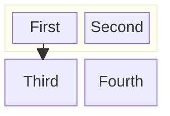
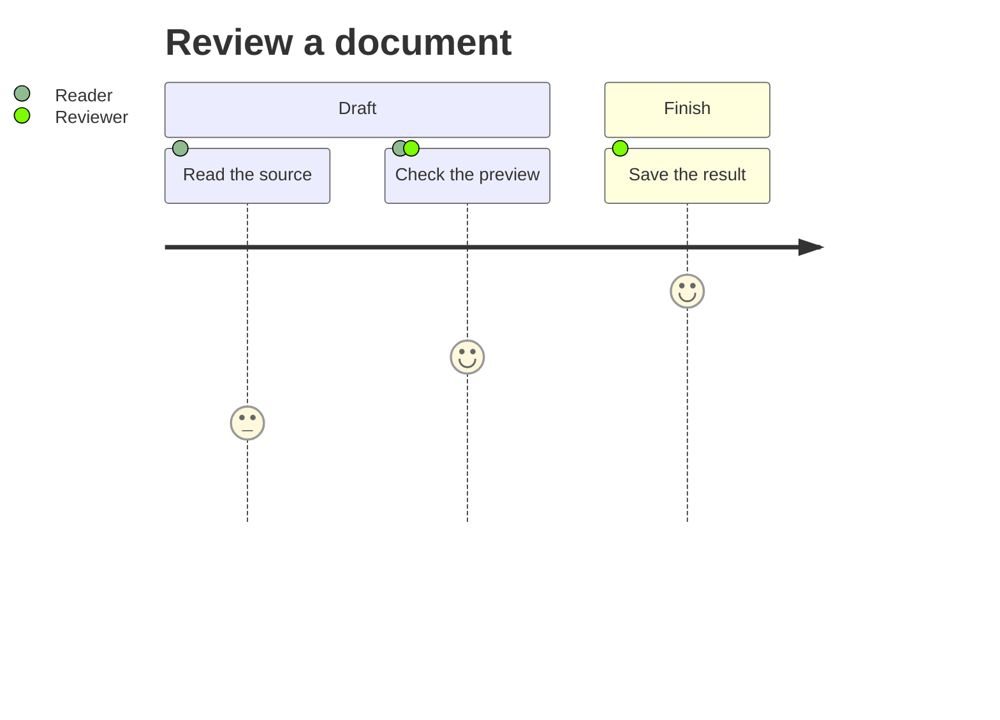

# Mixed Markdown control

This **bold** paragraph combines *emphasis*, `inline code`, ==highlighting==,
x^2^, H~2~O and inline math $a^2 + b^2 = c^2$ with a footnote.[^note]

> A quote containing <STRONG>uppercase HTML</STRONG>, <EM>emphasis</EM>,
> and an <A HREF="https://tinta.cc">uppercase link tag</A>.

## Table and source

| Item | Example | Result |
| --- | --- | --- |
| Script | x^2^ and H~2~O | Keep the baseline |
| Math | $\frac{a}{b}$ | Keep cell height |
| Text | **bold** and `code` | Keep formatting |

```sql
SELECT title, updated FROM documents WHERE active = 1;
```

- Preserve list indentation and [links](https://tinta.cc).
- Preserve **emphasis** beside $E=mc^2$.

### Configured flowchart labels


### Nested block layout



### Journey score lane



#### Fourth heading

$$
\begin{pmatrix}a & b\\c & d\end{pmatrix}
$$

##### Fifth heading

###### Sixth heading

All six levels should remain visible in Contents.

[^note]: A footnote with **bold text**, `code`, and $x^2$.
