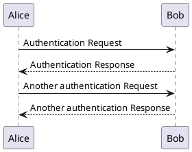
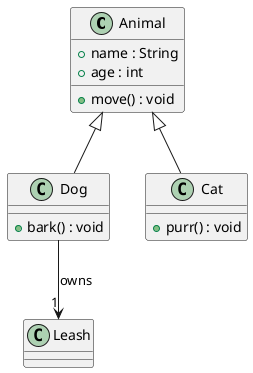
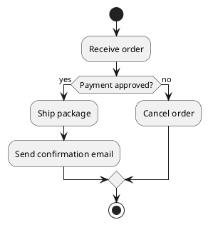

# PlantUML Diagrams Fixture

This mixed document exercises the PlantUML fence gates in the preview,
print path and the HTML/DOCX exporters. Around the diagrams it carries
headings, paragraphs, lists, quotes, tables, *emphasis* and links so
surrounding layout is checked together with the feature itself.

Expected HTML export gates:

- REAL tool (a locally installed PlantUML jar run through Java):
  exactly **4** diagram divs (three valid PlantUML fences plus the
  mermaid control) and exactly **2** fallback code blocks carrying
  the PlantUML language class - the anchorless fence and the
  invalid-syntax fence (real PlantUML rejects it with exit 200 under
  `-failfast2`);
- FAKE tool: **5** diagram divs and **1** fallback - the fake does
  not parse, so it "renders" the invalid-syntax fence too; only the
  anchorless fence falls back;
- with the tool unset: zero PlantUML diagram divs, **5** plantuml
  fallback code blocks, and the mermaid control div unchanged;
- budget exhausted (slow tool): all five fences fall back, export
  still completes under 90 s.

- A plain list item
- A second item with `inline code`
- A third item with a [link to the PlantUML site](https://plantuml.com/)

> Quote: PlantUML renders through a locally installed tool; Tinta never
> reaches the network for diagrams.

The render queue dedupes identical sources by a content hash, so a
repeated fence costs at most one tool run:

$$k = hash(source)$$

| Fence | Kind | Expected outcome |
| --- | --- | --- |
| sequence | valid `@startuml` | inline SVG diagram |
| class | valid `@startuml` | inline SVG diagram |
| activity | valid `@startuml` | inline SVG diagram |
| anchorless | no `@startuml` | source-code fallback |
| invalid | malformed syntax | real tool rejects it (exit 200) -> source-code fallback; the fake renders it anyway |

```cpp
// a plain code fence, never a diagram
int main() { return 0; }
```

## Sequence Diagram



## Class Diagram



## Activity Diagram



## Anchorless Fallback

The fence below deliberately has no `@startuml` anchor, so it falls back
to source code under the fake tool and under the real one alike.

```plantuml
this source has no startuml anchor
so it must always render as a code block
```

## Invalid-Syntax Fallback

The fence below carries an `@startuml` anchor but its body is
malformed, so the real PlantUML tool rejects it with exit 200 under
`-failfast2` and the exporter falls through to source code. The fake
tool does not parse and "renders" it as well - that asymmetry is
documented in the gate table above.

```plantuml
@startuml
class A {
@enduml
```

## Mermaid Control


## Closing Notes

After the diagrams, the export must keep flowing text, more code and a
final table intact. The **fit-to-width** and copy-as-image affordances
apply to the rendered diagrams just like they do in the preview.

```json
{ "fixture": "plantuml-diagrams", "plantumlFences": 5, "realTool": { "diagramDivs": 4, "fallbacks": 2 }, "fakeTool": { "diagramDivs": 5, "fallbacks": 1 } }
```

| Element | Checked |
| --- | --- |
| Trailing paragraph | yes |
| Trailing code fence | yes |
| This table | yes |
