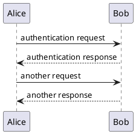
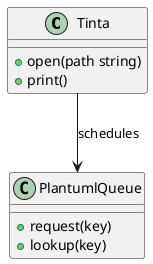
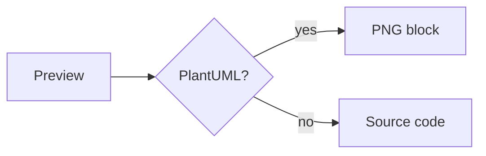

# PlantUML preview fixture

This document mixes regular markdown with PlantUML fences so the preview
layout, print path and copy-as-image can be exercised together. The plantuml
tool is expected from the test harness settings (`plantumlPath`), not from the
machine.

## Before the diagrams

A paragraph with **bold**, *emphasis*, `inline code` and a [link](https://plantuml.com).

- first bullet, plain text
- second bullet with `code` inside
  - nested item

| Column A | Column B |
|---|---|
| alpha | beta |
| gamma | delta |

> A blockquote so surrounding text blocks are exercised above the diagrams.

## Sequence diagram

Text between the two fences keeps both sides checked.

## Class diagram

## Control: mermaid fence (must stay untouched)

## After the diagrams

Closing paragraph: the layout must continue cleanly after the last diagram,
including this final line.
