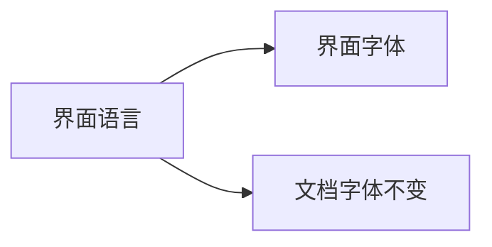

# 界面字体跟随界面语言 (#254)

Set Settings → General → Language to 简体中文, then check that every piece of
interface text below draws its Chinese in Microsoft YaHei UI (Simplified
Chinese shapes; the commas and full stops sit low and to the left): the tab
title, the context menu, the settings panel, the contents panel, the 复制 button
on the code block, 复制TSV on the table, 图片 on the diagram, and the Read
button and word count in the editor. Switch to 日本語 or 한국어
and the same text follows that language's font without a restart. The document
itself keeps its font whatever the interface language.

## 段落与强调

这是一段**加粗**、*斜体*和`行内代码`混排的中文文字，后面跟着一个
[链接](https://example.com)。设置、阅读、复制、关闭——这些常用词也出现在界面里。

- 列表第一项：打开文件
- 列表第二项：另存为
- [ ] 待办：检查目录面板
- [x] 已完成：检查标签页标题

> 引用：界面文字应当使用界面语言的字体，文档正文保持原样。

## 表格

| 菜单项 | 快捷键 | 说明 |
| --- | --- | --- |
| 打开文件 | Ctrl+O | “复制TSV”按钮显示在表格右上角 |
| 设置 | Ctrl+, | 中文、English 与 日本語 混排 |

## 代码

```cpp
// 代码块右上角的“复制”按钮使用界面字体
const wchar_t* label = L"阅读设置";
```

## 图表



### 结尾

最后一段：目录面板里的标题也应使用同一种中文字体。
